# Weather

Weather inspired by [Pixel Weather](https://play.google.com/store/apps/details?id=com.google.android.apps.weather) and [Weather Master](https://github.com/PranshulGG/WeatherMaster)
 
## Screenshots

### Designs

<table>
    <tr>
        <th colspan="2">Pixel Weather Design</th>
        <th colspan="2">Froggy Weather Design</th>
    </tr>
    <tr>
        <th>Current Weather Adapted</th>
        <th>Current Weather Animated</th>
        <th>Current Weather Adapted</th>
        <th>Current Weather Animated</th>
    </tr>
    <tr>
        <td>
            <picture>
                <source
                    media="(prefers-color-scheme: dark), (prefers-color-scheme: no-preference)"
                    srcset="images/screenshot_designs_adapted_dark.png"
                />
                <source
                    media="(prefers-color-scheme: light)"
                    srcset="images/screenshot_designs_adapted_light.png"
                />
                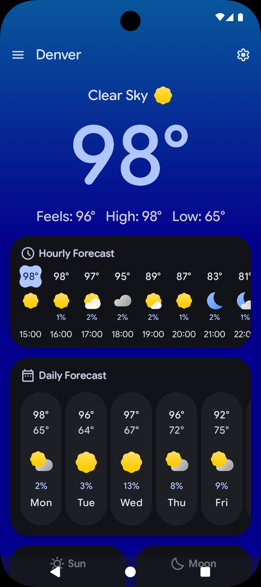
            </picture>
        </td>
        <td>
            <picture>
                <source
                    media="(prefers-color-scheme: dark), (prefers-color-scheme: no-preference)"
                    srcset="images/screenshot_designs_adapted_animated_dark.png"
                />
                <source
                    media="(prefers-color-scheme: light)"
                    srcset="images/screenshot_designs_adapted_animated_light.png"
                />
                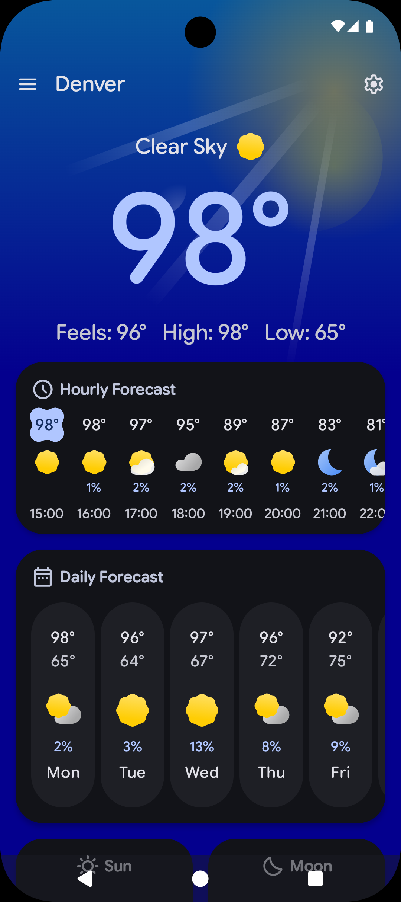
            </picture>
        </td>
        <td>
            <picture>
                <source
                    media="(prefers-color-scheme: dark), (prefers-color-scheme: no-preference)"
                    srcset="images/screenshot_designs_froggy_adapted_dark.png"
                />
                <source
                    media="(prefers-color-scheme: light)"
                    srcset="images/screenshot_designs_froggy_adapted_light.png"
                />
                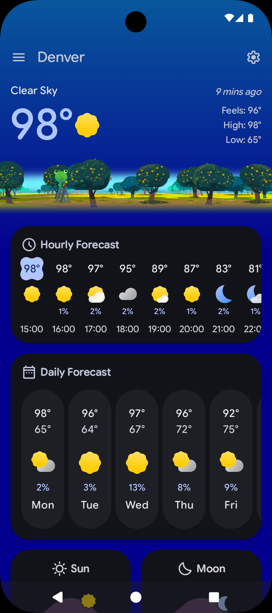
            </picture>
        </td>
        <td>
            <picture>
                <source
                    media="(prefers-color-scheme: dark), (prefers-color-scheme: no-preference)"
                    srcset="images/screenshot_designs_froggy_adapted_animated_dark.png"
                />
                <source
                    media="(prefers-color-scheme: light)"
                    srcset="images/screenshot_designs_froggy_adapted_animated_light.png"
                />
                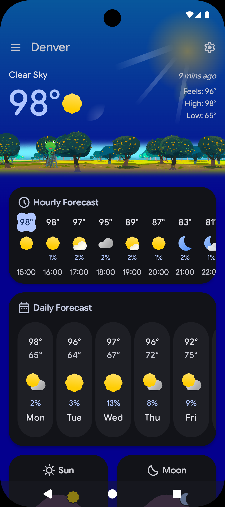
            </picture>
        </td>
    </tr>
</table>

### Conditions

<table>
    <tr>
        <th>Humidity</th>
        <th>Pressure</th>
        <th>Rain</th>
        <th>Snow</th>
        <th>Sun & Moon</th>
        <th>UV Index</th>
        <th>Visibility</th>
        <th>Wind</th>
    </tr>
    <tr>
        <td>
            <picture>
                <source
                    media="(prefers-color-scheme: dark), (prefers-color-scheme: no-preference)"
                    srcset="images/screenshot_conditions_humidity_dark.png"
                />
                <source
                    media="(prefers-color-scheme: light)"
                    srcset="images/screenshot_conditions_humidity_light.png"
                />
                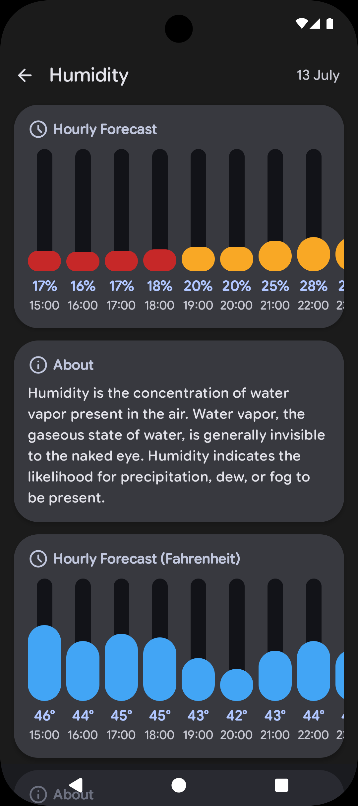
            </picture>
        </td>
        <td>
            <picture>
                <source
                    media="(prefers-color-scheme: dark), (prefers-color-scheme: no-preference)"
                    srcset="images/screenshot_conditions_pressure_dark.png"
                />
                <source
                    media="(prefers-color-scheme: light)"
                    srcset="images/screenshot_conditions_pressure_light.png"
                />
                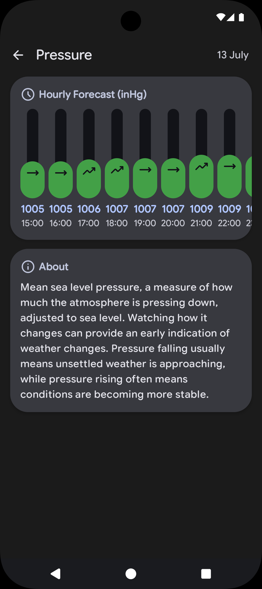
            </picture>
        </td>
        <td>
            <picture>
                <source
                    media="(prefers-color-scheme: dark), (prefers-color-scheme: no-preference)"
                    srcset="images/screenshot_conditions_rain_dark.png"
                />
                <source
                    media="(prefers-color-scheme: light)"
                    srcset="images/screenshot_conditions_rain_light.png"
                />
                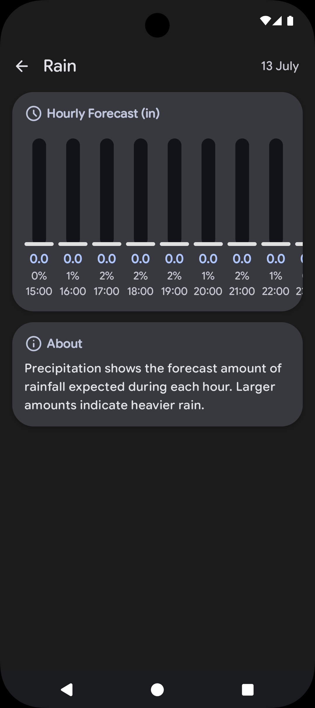
            </picture>
        </td>
        <td>
            <picture>
                <source
                    media="(prefers-color-scheme: dark), (prefers-color-scheme: no-preference)"
                    srcset="images/screenshot_conditions_snow_dark.png"
                />
                <source
                    media="(prefers-color-scheme: light)"
                    srcset="images/screenshot_conditions_snow_light.png"
                />
                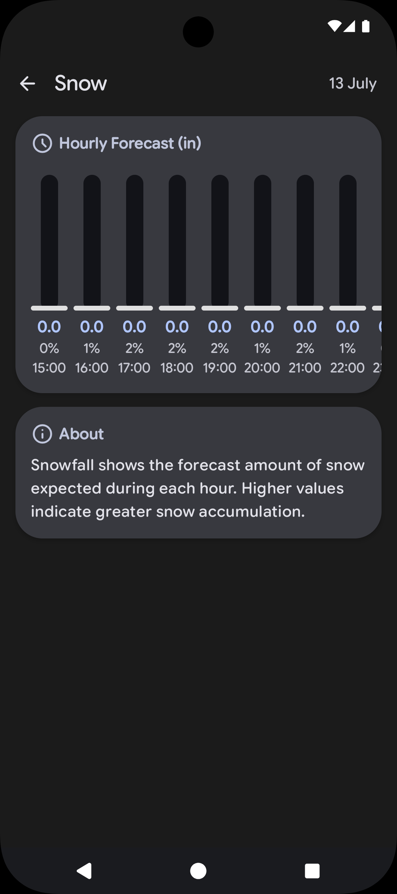
            </picture>
        </td>
        <td>
            <picture>
                <source
                    media="(prefers-color-scheme: dark), (prefers-color-scheme: no-preference)"
                    srcset="images/screenshot_conditions_sun_moon_dark.png"
                />
                <source
                    media="(prefers-color-scheme: light)"
                    srcset="images/screenshot_conditions_sun_moon_light.png"
                />
                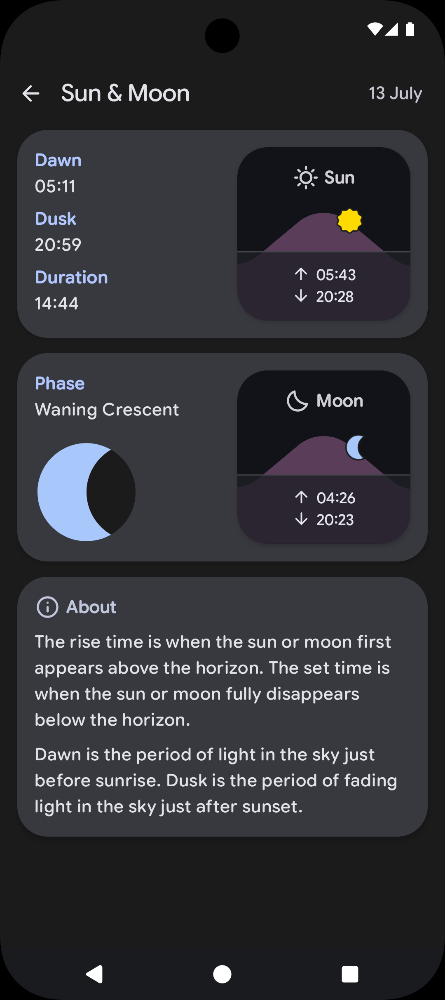
            </picture>
        </td>
        <td>
            <picture>
                <source
                    media="(prefers-color-scheme: dark), (prefers-color-scheme: no-preference)"
                    srcset="images/screenshot_conditions_uv_index_dark.png"
                />
                <source
                    media="(prefers-color-scheme: light)"
                    srcset="images/screenshot_conditions_uv_index_light.png"
                />
                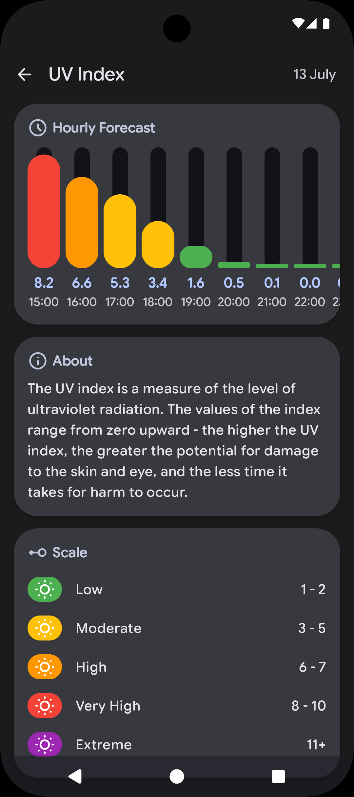
            </picture>
        </td>
        <td>
            <picture>
                <source
                    media="(prefers-color-scheme: dark), (prefers-color-scheme: no-preference)"
                    srcset="images/screenshot_conditions_visibility_dark.png"
                />
                <source
                    media="(prefers-color-scheme: light)"
                    srcset="images/screenshot_conditions_visibility_light.png"
                />
                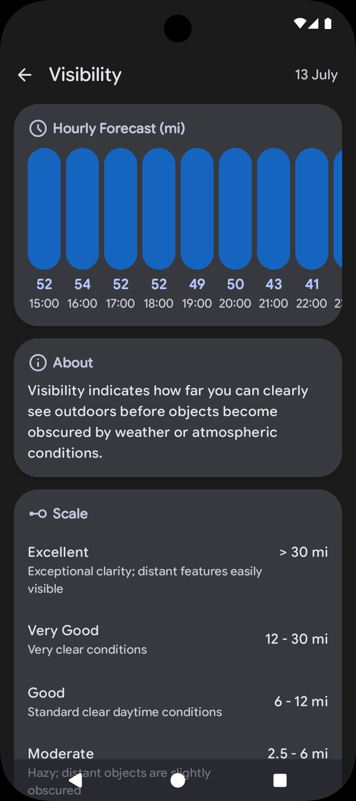
            </picture>
        </td>
        <td>
            <picture>
                <source
                    media="(prefers-color-scheme: dark), (prefers-color-scheme: no-preference)"
                    srcset="images/screenshot_conditions_wind_dark.png"
                />
                <source
                    media="(prefers-color-scheme: light)"
                    srcset="images/screenshot_conditions_wind_light.png"
                />
                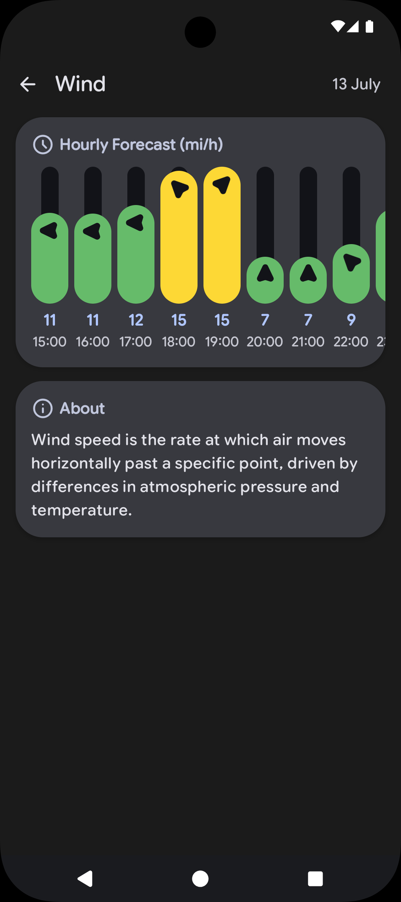
            </picture>
        </td>
    </tr>
</table>

### Settings

<table>
    <tr>
        <th>All</th>
        <th>Appearance</th>
        <th>Application Languages</th>
        <th>Weather Sources</th>
    </tr>
    <tr>
        <td>
            <picture>
                <source
                    media="(prefers-color-scheme: dark), (prefers-color-scheme: no-preference)"
                    srcset="images/screenshot_settings_all_dark.png"
                />
                <source
                    media="(prefers-color-scheme: light)"
                    srcset="images/screenshot_settings_all_light.png"
                />
                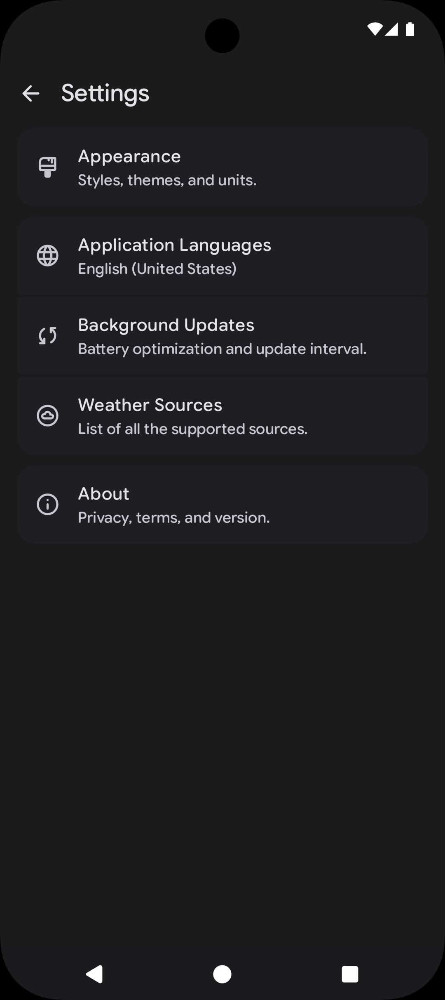
            </picture>
        </td>
        <td>
            <picture>
                <source
                    media="(prefers-color-scheme: dark), (prefers-color-scheme: no-preference)"
                    srcset="images/screenshot_settings_appearance_dark.png"
                />
                <source
                    media="(prefers-color-scheme: light)"
                    srcset="images/screenshot_settings_appearance_light.png"
                />
                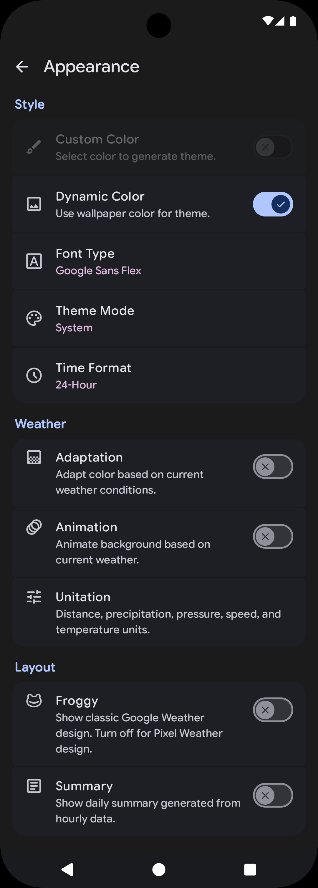
            </picture>
        </td>
        <td>
            <picture>
                <source
                    media="(prefers-color-scheme: dark), (prefers-color-scheme: no-preference)"
                    srcset="images/screenshot_settings_languages_dark.png"
                />
                <source
                    media="(prefers-color-scheme: light)"
                    srcset="images/screenshot_settings_languages_light.png"
                />
                
            </picture>
        </td>
        <td>
            <picture>
                <source
                    media="(prefers-color-scheme: dark), (prefers-color-scheme: no-preference)"
                    srcset="images/screenshot_settings_sources_dark.png"
                />
                <source
                    media="(prefers-color-scheme: light)"
                    srcset="images/screenshot_settings_sources_light.png"
                />
                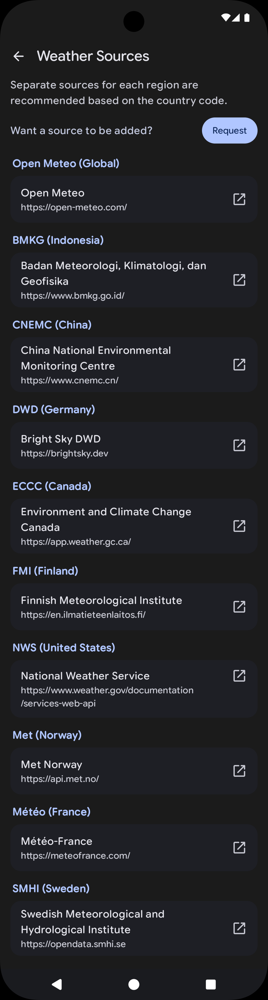
            </picture>
        </td>
    </tr>
</table>

## Sources

- **Open Meteo (Global)**
- **BMKG (Indonesia)**
- **CNEMC (China)**
- **DWD (Germany)**
- **ECCC (Canada)**
- **FMI (Finland)**
- **NWS (United States)**
- **Met (Norway)**
- **Meteo (France)**
- **SMHI (Sweden)**

## Translations

To request a language, feel free to open an issue on [Crowdin](https://crowdin.com/project/weathermaster).

 
 
 
 
 
 
 
 
 
 
 
 
 
 
 
 
 
 
 
 
 
 
 
 
 
 
 
 
 
 
 
 
 
 
 
 
 
